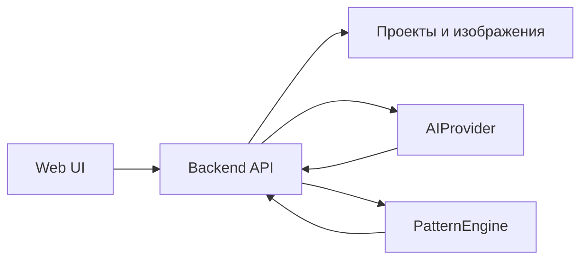
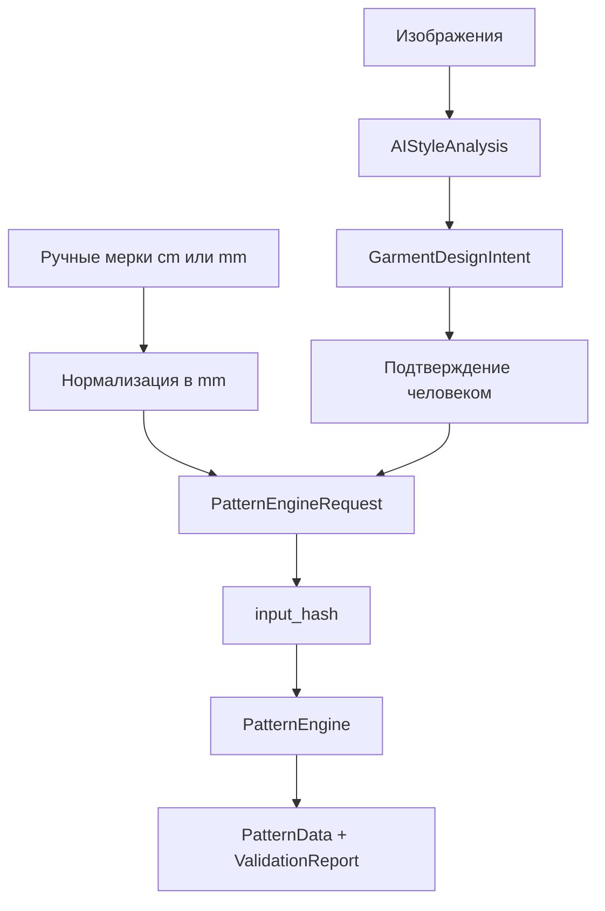

# Архитектура Kroika

Версия контрактов: **1.0.0** · Этап расширения: **18/20** · Стиль: модульный монолит.

## Главное решение

Веб-приложение, работа с AI, хранение и математический движок будут отдельными модулями одного репозитория. Между ними передаются только документы, прошедшие версионированные контракты. Pattern Engine не импортирует FastAPI, UI или SDK Qwen/Gemini и не принимает изображения.



AI возвращает предложение о видимых признаках и расширенный `design_features`. UI
преобразует его в проверяемый `GarmentDesignIntent`: каждый элемент получает статус
`supported`, `planned`, `needs_confirmation` или `excluded` и ссылку на разрешённый
модуль. Редактор этапа 17 сохраняет ручные исправления, размеры, ответы и подтверждение
каждой включённой записи. Только полностью проверенный и поддержанный план может стать
подтверждённым `GarmentSpec` и попасть в
`PatternEngineRequest`. Эта граница не позволяет ответу модели напрямую стать выкройкой
или молча потерять волан, складку, пояс либо накладной слой.

Компилятор этапа 18 применяет только пять версионированных bounded-модулей:
центральную складку, добавку под сборку, круговой волан, регулируемый прямой пояс и
отдельный прямой ремень. Расширение/заужение низа выполняется базовым построителем и
попадает в тот же аудиторский журнал. После операций заново строятся припуски и
проверяются парные срезы. Кокетки, панели и перенос вытачки имеют формулы и эталоны,
но остаются `planned`, пока не реализовано безопасное изменение всей топологии швов.

## Контракты предметной области

Все схемы используют JSON Schema 2020-12, запрещают неизвестные поля и имеют версию `1.0.0`. Каноническая единица длины — mm.

| Сущность | Назначение | Ключевая защита |
| --- | --- | --- |
| `BodyMeasurements` | Профиль ручных мерок и происхождение каждого значения | Статус `ready` требует все входы текущей методики; cm допускаются только как сохранённый исходный ввод |
| `GarmentSpec` | Подтверждённые человеком параметры фасона | Предложение AI и подтверждённый фасон имеют разные схемы и статусы |
| `GarmentDesignIntent` | Прослеживаемый план деталей, слоёв, пропорций, ручных решений и ответов | Включённый неподдержанный/непроверенный элемент блокирует генерацию; исключённый остаётся в истории |
| `FitSettings` | Прибавки на свободу, модельные прибавки и припуски | Три набора не смешиваются; доли переда/спинки проверяются отдельно |
| `FabricProperties` | Структура, стабильность, растяжимость и назначение ткани | Подтверждённая ткань не может сохранять значения `unknown` |
| `FormulaRecord` | Формула, единицы, источник, область и доказательства проверки | Все 41 записи этапа 2 проходят схему; production требует полного набора проверок |
| `PatternProject` | Сохраняемый агрегат проекта с ревизией и историей | Версии метода и результата не меняются молча; связи проверяются по ID и hash |
| `ValidationReport` | Машиночитаемые проверки и понятные сообщения | Блокирующая ошибка исключает производственный экспорт |

Вспомогательные схемы определяют AI-запрос/ответ, запрос/ответ Pattern Engine и каноническую геометрию `PatternData`. Геометрическое ядро этапа 6 реализует линии, кубические Безье, эллиптические дуги и контуры. Этапы 7–9 добавляют F01–F41, детали изделия, припуски по сегментам и диагностическую печать A4 1:1.

## Поток данных



`input_hash` вычисляется из значений, способных изменить геометрию или область применимости. Имена, время подтверждения и происхождение мерки в hash не входят. Для применяемых модельных операций в hash-контракт `1.1.0` входят ID источника, тип, вариант, расположение, конструкция, количество, размеры и версия модуля; запросы без них сохраняют исторический контракт `1.0.0` и прежние hash. Изменение любой мерки, прибавки, конструктивного параметра, свойства ткани или версии методики меняет hash. JSON канонизируется с сортировкой ключей; `NaN` и бесконечности запрещены.

Повторный запрос с тем же hash для того же проекта возвращает сохранённый результат и не добавляет запись истории. Ограничение по `project_id` исключает выдачу результата между двумя проектами с одинаковыми входами.

## Границы модулей

| Модуль | Получает | Возвращает | Чего внутри нет |
| --- | --- | --- | --- |
| Web UI | Представления API | Подтверждённые пользовательские действия | Формул построения и API-ключей |
| Backend API | JSON/файлы от UI | OpenAPI-ответы на русском | Собственной геометрии |
| AI adapter | `AIAnalysisRequest` с 1–4 ссылками на подготовленные изображения | `AIStyleAnalysis` | Мерок тела, прибавок и координат лекал |
| Pattern Engine | Подтверждённый `PatternEngineRequest` | `PatternEngineResult`; внутри — чистое геометрическое ядро | Изображений, SDK провайдеров, HTTP и базы данных |
| Persistence | Версионированные проекты, результаты и профили мерок | Копии конкретной ревизии | Неявных миграций при чтении |

Python-интерфейсы находятся в [ports.py](../src/kroika_contracts/ports.py). Они используют `Protocol`, поэтому mock, Qwen и Gemini имеют одну границу без общей SDK-зависимости. Реализованы `MockAIProvider` и fail-closed `GeometryPatternEngine`: базовые блоки строятся и проверяются внутри движка, но `pattern=null` сохраняется до сборки изделия и пар швов этапа 8. Сетевые AI-адаптеры появятся на этапе 10.

## Структура монорепозитория

`frontend`, `backend` и `pattern-engine` являются отдельными пакетами. Папка `src/kroika_contracts` остаётся общей контрактной библиотекой. Backend — единственная точка, связывающая SQLite, AI-адаптер и движок.

```text
frontend/                 React + TypeScript + Vite
backend/                  FastAPI, application services, SQLite adapters
pattern-engine/           чистый Python, геометрия и методики
src/kroika_contracts/     схемы, hash, смысловые проверки, порты, миграции
schemas/                  канонические JSON Schema и OpenAPI
examples/                 проверяемые примеры документов
tests/                    контрактные и последующие тесты
```

## Ошибки для пользователя

JSON Schema проверяет форму документа, затем semantic validation проверяет отношения полей: диапазоны мерок, соответствие исходных cm нормализованным mm, порядок контрольных длин, отношение дуг к полным обхватам, сумму долей прибавки, область ткани и поддержанную комбинацию фасона. Ошибки имеют стабильный `code`, JSON Pointer и сообщение по-русски. Backend возвращает их без трассировки и введённых чисел. JSON-лог содержит только request ID, метод, шаблон маршрута, статус и длительность.

Текущая методика `experimental`, поэтому контракт не может разрешить производственный экспорт. Диагностический результат и производственный файл имеют отдельные флаги. Архитектурный gate этапа 3 не меняет незакрытый экспертный gate методики этапа 2.

## API

[openapi.v1.yaml](../schemas/openapi.v1.yaml) фиксирует 19 операций, включая единый печатный SVG и диагностический PDF A4. `PUT` проекта и профиля использует номер ревизии через `If-Match`, чтобы одна вкладка не затёрла изменения другой. Список профилей намеренно не содержит сами мерки. SQLite работает в WAL-режиме, а документы проходят JSON Schema и смысловую проверку до записи.
