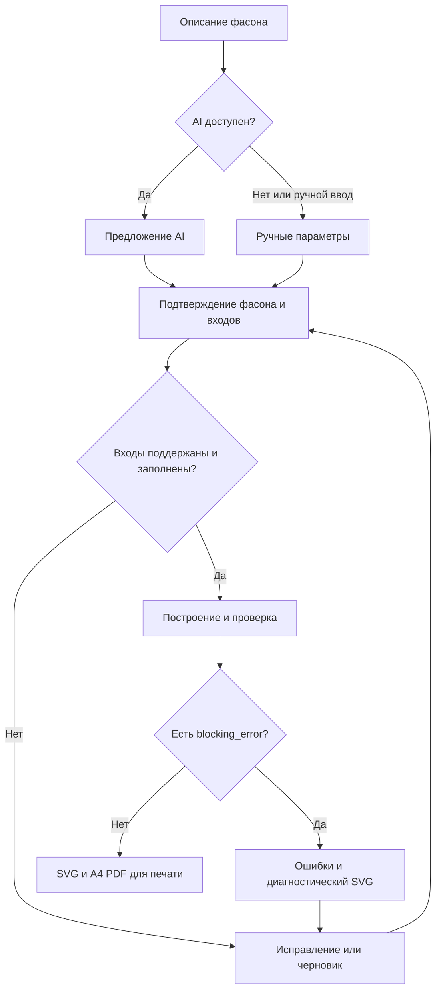

# Карта пользовательского сценария

Это проект поведения будущего приложения. К концу исследовательской части этапа 2 интерфейс и обработчики ещё не создавались.

## Основной путь

| Шаг / экран | Действие закройщика | Ответ системы | Условие перехода |
| --- | --- | --- | --- |
| 1. Проект | Создаёт проект, выбирает платье или сарафан | Черновик, краткие подсказки, перечень доступных конструкций | Выбран поддержанный тип |
| 2. Изображения или ручное описание | Загружает 1–4 изображения либо выбирает ручной ввод | Предпросмотр, проверка формата; AI предлагает признаки, mock подписан как тест | Есть предложение фасона или ручные значения |
| 3. Подтверждение фасона | Проверяет силуэт, вырез, рукав, юбку, длину, застёжку и швы; отвечает на вопросы о скрытых деталях | Показывает признаки и неясности рядом с исходным изображением | Все конструктивно значимые поля подтверждены; сочетание поддержано |
| 4. Мерки | Выбирает профиль или вводит значения с подсказками и единицами | Проверяет обязательность, диапазоны и согласованность; показывает происхождение | Нет блокирующих ошибок мерок; отсутствующее не заменено средним |
| 5. Ткань, прибавки, припуски | Подтверждает свойства ткани и значения, выбирает обработку краёв | Раздельно показывает прибавки и припуски; объясняет ограничения пресета | Совместимые настройки и подтверждённые величины |
| 6. Построение | Нажимает «Построить выкройку» | Вычисляет детали по версии методики, затем проверяет геометрию | Получен результат с отчётом или конкретная ошибка |
| 7. Просмотр и проверка | Масштабирует SVG, переключает слои, изучает ошибки | Показывает шов/срез, долевые, сгибы, вытачки, надсечки, размеры, количество кроя, версию и статус | Нет blocking_error для производственного экспорта |
| 8. Экспорт | Выбирает A4 PDF, цельный SVG или JSON проекта | Формирует результат из той же геометрии; PDF содержит карту листов и квадрат | Для раскроя — геометрия валидна; статус проверки виден |
| 9. Бумага и макет | Печатает тестовый квадрат при 100%, измеряет его; собирает листы, проверяет детали, шьёт макет | Инструкция печати и возможность зафиксировать замечания | Специалист документирует результат; готовность не присваивается автоматически |

Черновики сохраняются на протяжении работы. Повторное открытие восстанавливает подтверждённые входы и версии. Отказ AI не лишает пользователя доступа к ручному вводу и сохранённым проектам.

## Развилки перед получением выкройки

Диагностический SVG явно маркируется и не выдаётся за файл для раскроя. Отсутствие blocking_error не доказывает посадку; непроверенный модуль сохраняет статус `experimental`.

## Ошибки и восстановление

| Ситуация | Требуемое поведение |
| --- | --- |
| Одна фотография спереди | Система спрашивает о спинке и невидимых узлах; не назначает их молча |
| Нечитаемое фото, не одежда или конфликт видов | Объясняет проблему; предлагает заменить изображения или описать фасон вручную |
| AI timeout, auth, rate_limit, invalid_schema, provider_unavailable | Понятное сообщение, сохранение введённого, повтор в установленном лимите либо ручной ввод; никаких ключей в сообщении |
| Неизвестная обязательная мерка | Показывает, какую мерку снять; запрещает генерацию до ввода |
| Несогласованные мерки | Показывает конкретные поля и нейтральное пояснение; сомнение не заменяется оценкой фигуры |
| Неподдержанный фасон | Показывает неподдержанные элементы, позволяет исправить или сохранить черновик; замена фасона только с подтверждением |
| Самопересечение, пустая деталь, несогласованные швы | Блокирует экспорт для раскроя; показывает проблемную деталь и диагностический результат, если он может быть сформирован |
| Ошибка генерации без геометрического результата | Сохраняет входы и объясняет причину; не создаёт пустой «успешный» файл |
| Изменение фасона или мерок после построения | Старый результат остаётся в истории; экспорт нового варианта требует пересчёта и повторной проверки |
| Новая версия методики | Сохранённая версия проекта не меняется молча; пересчёт создаёт новую версию |
| Квадрат после печати имеет неверный размер | Пользователь проверяет настройки масштаба и повторяет тест до печати комплекта; программа не подтверждает бумажный масштаб без измерения |
| Удаление проекта | После явного действия удаления удаляются проект и связанные изображения по согласованной политике |

## Первый будущий контрольный сценарий

Согласованный фасон из [PRODUCT_SPEC.md](PRODUCT_SPEC.md) → разрешённый тестовый эскиз через mock → ручное подтверждение → один из подписанных на этапе 2 профилей мерок → согласованные ткань и прибавки → детерминированное построение → отчёт без блокирующих ошибок → PDF → измерение квадрата 50 × 50 мм и бумажных линий.

Перед приёмкой полного сценария на этапе 11 этот путь повторяется с реальным AI-провайдером. Ни рисунок фасона, ни успешный ответ mock не подменяют построение лекал.
